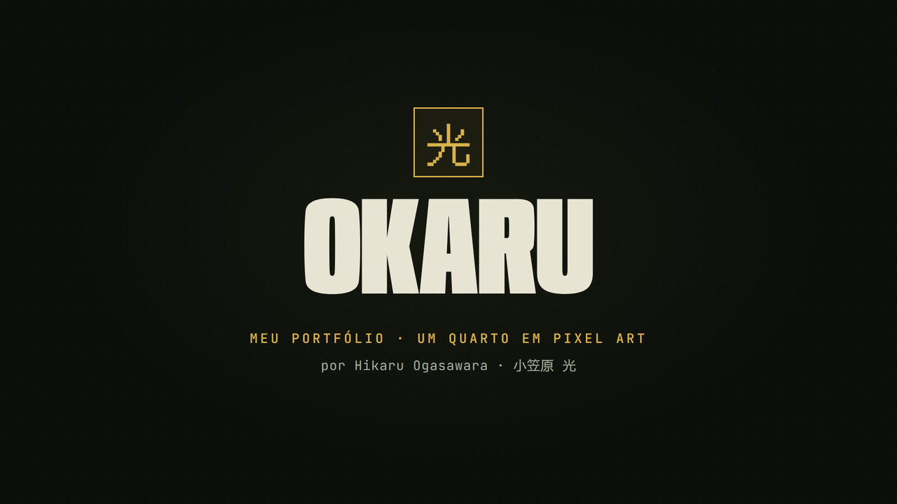

# Portfolio — Hikaru Ogasawara

**Visit · Acesse · サイト:** [hikaru-portfolio.okaru01.workers.dev](https://hikaru-portfolio.okaru01.workers.dev/)

**▶ Making-of (2:54):** how it was built · como foi feito · 制作の裏側. On-screen text in Portuguese.

<b>English</b>

An interactive pixel-art portfolio: an explorable room with projects, a lab, a skill tree, minigames, résumés and a fast lane for recruiters. Available in English, Portuguese and Japanese.

## About me

Nice to meet you! I'm Hikaru Ogasawara (小笠原 光), 21, based in São Paulo and studying Computer Engineering at Ibmec, with graduation expected in 2027. I enjoy hardware, infrastructure and security, and spend much of my time building labs and personal projects.

Since childhood I've enjoyed building things, fixing what breaks and discovering how things work inside. That curiosity remains; only the tools have changed: the screwdriver became a multimeter, a terminal and firmware. I learn by doing: build, test, measure, break it and build it again until it's right, understanding the why before accepting the how.

Outside university, I'm vice president of Ycare, a volunteer organization that delivers food and hygiene baskets to a community on the second Saturday of each month. I handle fundraising, packing the baskets and coordinating volunteers. In my spare time, I play a bit of everything.

- **Education:** Computer Engineering at Ibmec (bachelor's, 2023–2027, expected) · Instituto Sidarta (high school, 2010–2022)
- **Languages:** Native Portuguese · English: fluent reading, conversational speaking · upper-intermediate Japanese · intermediate Spanish
- **Strengths:** Calm under pressure · initiative · self-motivation · teamwork · respect for deadlines
- **Seeking:** An internship in infrastructure, security or embedded systems

## Contact and résumés

- **Email:** [hogasawara2311@outlook.com](mailto:hogasawara2311@outlook.com)
- **LinkedIn:** [/in/hikaru-ogasawara](https://www.linkedin.com/in/hikaru-ogasawara)
- **GitHub:** [Hikaru-0gasawara](https://github.com/Hikaru-0gasawara)
- **Résumé:** [English](public/resume/hikaru-en.pdf) · [Português](public/resume/hikaru-pt.pdf) · [日本語](public/resume/hikaru-ja.pdf)

## Projects

| Project | Area | Summary | Code |
| --- | --- | --- | --- |
| **AquaSense IoT** | IoT · firmware · web | ESP32 firmware for 7 water parameters, MQTT/TLS and a dashboard (Feb–Jun 2026) | [repository](https://github.com/Hikaru-0gasawara/IoT-PoolHardWareTest) |
| **Infrastructure lab** | Infrastructure · security | AD/DC, IPFire firewall and SIEM built from scratch, virtualized on Proxmox (academic) | — |
| **Electronic safe** | Embedded · C++ | The same safe ported to Arduino UNO, Raspberry Pi Pico and ESP32 (personal) | [repository](https://github.com/Hikaru-0gasawara/IoT-SafeSistem) |
| **CPTM assets** | Back end · Java | REST API with 14 endpoints for trains, stations and lines (Feb–Jul 2024) | [repository](https://github.com/0tavio-Pires/Projeto_Back-End) |

In the portfolio, each project has a description, a gallery of diagrams (plus screenshots of the dashboard for AquaSense) and the technical details.

## Technologies

- **Hardware and firmware:** ESP32, Arduino UNO, Raspberry Pi Pico, C/C++, MicroPython, I²C, UART, PWM, MQTT over TLS, LogiSim
- **Infrastructure and security:** Proxmox, Windows Server with AD/DC, Linux, DNS, DHCP, IPFire, iptables, ufw, SIEM, Kali Linux
- **Software:** Python, Java with Spring Boot, TypeScript with React, HTML and CSS, SQL
- **Data and cloud:** Jupyter, NumPy, pandas, Excel, Power BI, AWS Lambda, Alexa Skills Kit
- **Tools and testing:** Git, GitHub Actions, Vitest, Playwright, JUnit, Postman

## The portfolio

The site itself is the demo: instead of just listing skills, it's a small game that shows what I can do.

- **Language select:** the first screen, an 8-bit menu under a pixel sky, with a cursor, an equalizer and its own soundtrack that changes style with the language under the cursor: samba for Portuguese, rock for English and matsuri for Japanese.
- **TV entrance:** after the language, a 3D television you can spin with the mouse and look at from behind, above and below, speaking the chosen language. It starts switched on, on the recruiter-mode channel (**“In a hurry? Break here”**), and has five more channels (fighting, monster battle, live show, RPG and western), volume, a power button and its own soundtrack playing through its speaker. **Enter** dives the camera into the screen and starts the boot. Holding the portfolio's power button turns everything off and leaves through the TV: the camera pulls back out of the screen, the reverse of the entrance, and the TV turns on again.
- **Boot:** a startup console with diagnostics and, every now and then, a fake crash buried under made-up error pop-ups, followed by a recovery.
- **Pages:** Home, Projects, About and Contact, walked by Hikaru himself in pixel art. He walks between the doors, trips now and then and sometimes takes a shortcut through the portals. Every page and the room are linked by hidden passages: a pedestal, doors and hatches drawn on the lines of the schematic and the panels, a door by the About title, two payphones linking Home and Contact, a passage behind the “?” of CONTINUE? and, in the room, a hatch under the pinball, stairs behind the shelf and a tunnel under the bed. The home buttons are passages themselves: **View projects** splits open like a trapdoor and drops him onto Projects, and **About me** slides aside over a secret staircase down to About.
- **Room:** a shelf, a Magic deck collection, plushies, arcade cabinets, a CRT TV with picture styles, a beanbag with a brick-breaker game and a computer you can sit at.
- **okwm, the computer:** sitting down pushes the camera into the monitor and lands on a lock screen whose password types itself, over a pixel-art São Paulo skyline at night. Inside is a tiling window manager in the portfolio palette: every app splits the focused tile, gutters resize, title bars swap tiles, four workspaces open their own sets, and `Alt` shortcuts (Enter, P, 1–4, H/J/K/L, M) drive it like i3. Twelve apps: terminal (neofetch, projects, contact…), Files with the project folders and résumés, a btop-style monitor of what the page really measures, the portfolio soundtracks, sticky notes, profile, skill tree, résumé, Lab, the offline game, world clock and settings. On phones the tiles become tabs.
- **Hitbox:** a fighting-game controller on About, with 42 moves from 22 fighters from Street Fighter, Mortal Kombat, Skullgirls, Guilty Gear and Avatar, plus Okaru's tech moves. Every move hits a training dummy.
- **Minigames:** cartridges for Game Boy, Atari, Master System, N64 and a modern controller, plus the Packet Invaders and Operation Circuit arcade cabinets.
- **Achievements:** 51 achievements spread across the site.
- **Recruiter mode:** a fast lane to projects and résumés for those short on time, with the same sound as the portfolio. To open it, break the entrance TV's screen (three knocks on the glass of the first channel) or the emergency glass in the pause menu.
- **Title screen:** its own 8-bit soundtrack, hover sounds and a button (or the `M` key) to mute.
- **On phones:** a touch joystick with **A** and **B**, and the section buttons fold into the logo, which opens them as a menu.

### Main controls

| Action | How |
| --- | --- |
| Walk | `WASD` or arrow keys (on phones, the on-screen joystick; **A** uses and **B** runs) |
| Interact | `E`, space or click |
| Pause and menu | `Esc` |
| Command palette and console | `Ctrl+K` |
| Language and reduced motion | Pause menu |

Everything runs in the browser, with no sign-up, tracking or server: progress, language and achievements are saved only in your browser.

## Code

Built with HTML, CSS and JavaScript, with React and fonts served locally, and no game or 3D libraries: the entrance television is rendered with hand-written WebGL. The technical notes (running locally, publishing, architecture, résumés and tests) are in [docs/](docs/), in Portuguese.

<b>Português</b>

Portfólio interativo em pixel art: um quarto explorável, com projetos, laboratório, árvore de habilidades, minijogos, currículos e um modo rápido para recrutadores. Disponível em português, inglês e japonês.

## Sobre mim

Muito prazer! Meu nome é Hikaru Ogasawara (小笠原 光). Tenho 21 anos, moro em São Paulo e estudo Engenharia da Computação no Ibmec, com formatura prevista para 2027. Gosto de hardware, infraestrutura e segurança, e passo boa parte do tempo montando laboratórios e projetos por conta própria.

Desde criança eu gosto de construir coisas, consertar o que quebra e descobrir como tudo funciona por dentro. A chave de fenda virou multímetro, terminal e firmware. Sou de aprender fazendo: montar, testar, medir, quebrar e montar de novo até ficar do jeito certo, entendendo o porquê antes de aceitar o como.

Fora da faculdade, sou vice-presidente da Ycare, uma organização voluntária que todo segundo sábado do mês leva cestas com alimentos e itens de higiene a uma comunidade. Cuido da arrecadação, da montagem das cestas e da mobilização dos voluntários. Nas horas vagas, jogo de tudo um pouco.

- **Formação:** Engenharia da Computação no Ibmec (bacharelado, 2023–2027, previsto) · Instituto Sidarta (ensino médio, 2010–2022)
- **Idiomas:** Português nativo · inglês fluente na leitura e semifluente na fala · japonês intermediário-avançado · espanhol intermediário
- **Pontos fortes:** Calma sob pressão · proatividade · automotivação · trabalho em equipe · responsabilidade com prazos
- **Procurando:** Estágio em infraestrutura, segurança ou sistemas embarcados

## Contato e currículos

- **E-mail:** [hogasawara2311@outlook.com](mailto:hogasawara2311@outlook.com)
- **LinkedIn:** [/in/hikaru-ogasawara](https://www.linkedin.com/in/hikaru-ogasawara)
- **GitHub:** [Hikaru-0gasawara](https://github.com/Hikaru-0gasawara)
- **Currículo:** [português](public/resume/hikaru-pt.pdf) · [English](public/resume/hikaru-en.pdf) · [日本語](public/resume/hikaru-ja.pdf)

## Projetos

| Projeto | Área | Resumo | Código |
| --- | --- | --- | --- |
| **AquaSense IoT** | IoT · firmware · web | Firmware ESP32 para 7 parâmetros da água, MQTT/TLS e dashboard (fev–jun 2026) | [repositório](https://github.com/Hikaru-0gasawara/IoT-PoolHardWareTest) |
| **Lab de infraestrutura** | Infra · segurança | AD/DC, firewall IPFire e SIEM do zero, virtualizados no Proxmox (acadêmico) | — |
| **Cofre eletrônico** | Embarcados · C++ | O mesmo cofre portado para Arduino UNO, Raspberry Pi Pico e ESP32 (pessoal) | [repositório](https://github.com/Hikaru-0gasawara/IoT-SafeSistem) |
| **Ativos da CPTM** | Back-end · Java | API REST com 14 endpoints para trens, estações e linhas (fev–jul 2024) | [repositório](https://github.com/0tavio-Pires/Projeto_Back-End) |

No portfólio, cada projeto tem descrição, galeria com diagramas (no AquaSense, também capturas do painel) e os detalhes técnicos.

## Tecnologias

- **Hardware e firmware:** ESP32, Arduino UNO, Raspberry Pi Pico, C/C++, MicroPython, I²C, UART, PWM, MQTT sobre TLS, LogiSim
- **Infraestrutura e segurança:** Proxmox, Windows Server com AD/DC, Linux, DNS, DHCP, IPFire, iptables, ufw, SIEM, Kali Linux
- **Software:** Python, Java com Spring Boot, TypeScript com React, HTML e CSS, SQL
- **Dados e nuvem:** Jupyter, NumPy, pandas, Excel, Power BI, AWS Lambda, Alexa Skills Kit
- **Ferramentas e testes:** Git, GitHub Actions, Vitest, Playwright, JUnit, Postman

## O portfólio

O próprio site é a demonstração: em vez de apenas listar habilidades, ele é um pequeno jogo que mostra o que eu sei fazer.

- **Escolha de idioma:** a primeira tela, um menu em 8 bits sob um céu de pixels, com cursor, equalizador e uma trilha própria que muda de estilo conforme o idioma sob o cursor: samba para o português, rock para o inglês e matsuri para o japonês.
- **Entrada pela TV:** depois do idioma, uma televisão 3D que você pode girar com o mouse e ver por trás, por cima e por baixo, falando o idioma escolhido. Ela já começa ligada, no canal do modo recrutador (**“Está com pressa? Quebre aqui”**), e tem mais cinco canais (luta, batalha de monstrinhos, show ao vivo, RPG e faroeste), volume e botão de energia, e uma trilha própria que sai pelo alto-falante dela. O botão **Entrar** mergulha a câmera dentro da tela e começa o boot. Segurar o botão de energia do portfólio desliga tudo e sai pela TV: a câmera recua de dentro da tela, o contrário da entrada, e a TV liga de novo.
- **Boot:** um console de inicialização com diagnósticos e, de vez em quando, uma falha fictícia soterrada por pop-ups de erro inventados, seguida da recuperação.
- **Páginas:** Início, Projetos, Sobre e Contato, percorridas pelo próprio Hikaru em pixel art. Ele anda entre as portas, tropeça de vez em quando e às vezes pega um atalho pelos portais. Todas as páginas e o quarto se ligam por passagens escondidas: um pedestal, portas e alçapões desenhados na linha do esquemático e dos painéis, uma porta ao lado do título de Sobre, dois orelhões ligando Início e Contato, uma passagem atrás do “?” de CONTINUE? e, no quarto, um alçapão sob o pinball, uma escada atrás da estante e um túnel debaixo da cama. Os próprios botões da home são passagens: **Ver projetos** se parte como um alçapão e o derruba em Projetos, e **Ver sobre** desliza para o lado e revela uma escada secreta até Sobre.
- **Quarto:** estante, coleção de decks de Magic, pelúcias, fliperamas, TV de tubo com estilos de imagem, puff com um jogo de quebrar blocos e um computador em que dá para sentar.
- **okwm, o computador:** sentar empurra a câmera para dentro do monitor e cai numa tela de bloqueio cuja senha se digita sozinha, sobre o skyline noturno de São Paulo em pixel art. Dentro, um gerenciador de janelas em mosaico com a paleta do portfólio: cada aplicativo divide o bloco focado, as calhas redimensionam, a barra de título troca blocos de lugar, quatro áreas de trabalho abrem seus próprios conjuntos e os atalhos com `Alt` (Enter, P, 1–4, H/J/K/L, M) o controlam como um i3. Doze aplicativos: terminal (neofetch, projetos, contato…), Arquivos com as pastas dos projetos e os currículos, um monitor no estilo btop do que a página realmente mede, as trilhas do portfólio, notas adesivas, perfil, árvore de habilidades, currículo, Lab, o jogo offline, relógio mundial e ajustes. No celular, os blocos viram abas.
- **Hitbox:** um controle de jogo de luta em Sobre, com 42 golpes de 22 lutadores de Street Fighter, Mortal Kombat, Skullgirls, Guilty Gear e Avatar, mais os golpes de tecnologia do Okaru. Cada golpe acerta um boneco de treino.
- **Minijogos:** cartuchos para Game Boy, Atari, Master System, N64 e controle moderno, além dos fliperamas Packet Invaders e Operação Circuito.
- **Conquistas:** 51 conquistas espalhadas pelo site.
- **Modo recrutador:** um caminho rápido para projetos e currículos, para quem tem pouco tempo, com o mesmo som do portfólio. Para abrir, quebre a tela da TV de entrada (três batidas no vidro do primeiro canal) ou o vidro de emergência do menu de pausa.
- **Tela de título:** trilha própria em 8 bits, sons de hover e um botão (ou a tecla `M`) para desligar o som.
- **No celular:** joystick de toque com **A** e **B**, e as seções da barra superior ficam guardadas dentro da logo, que as abre como menu.

### Controles principais

| Ação | Como |
| --- | --- |
| Andar | `WASD` ou setas (no celular, o joystick na tela; **A** usa e **B** corre) |
| Interagir | `E`, espaço ou clique |
| Pausa e menu | `Esc` |
| Paleta e console | `Ctrl+K` |
| Idioma e movimento reduzido | Menu de pausa |

Tudo roda no navegador, sem cadastro, rastreamento ou servidor: progresso, idioma e conquistas ficam salvos só no seu navegador.

## Código

Feito com HTML, CSS e JavaScript, com React e fontes servidos localmente, sem bibliotecas de jogo ou 3D: a televisão da entrada é renderizada em WebGL próprio. As notas técnicas (execução local, publicação, arquitetura, currículos e testes) ficam em [docs/](docs/).

<b>日本語</b>

ピクセルアートで作ったインタラクティブなポートフォリオです。探索できる部屋の中に、プロジェクト、ラボ、スキルツリー、ミニゲーム、履歴書、そして採用担当者向けの近道があります。日本語、英語、ポルトガル語に対応しています。

## 自己紹介

はじめまして、小笠原光です。21歳でサンパウロ在住。Ibmecでコンピュータ工学を学び、2027年に卒業予定です。ハードウェア、インフラ、セキュリティが好きで、自分でラボやプロジェクトを作っています。

子どもの頃から、ものを作り、壊れたものを直し、仕組みを知るのが好きでした。その好奇心は今も変わりません。ドライバーがテスター、ターミナル、ファームウェアに変わっただけです。組み立て、試し、測り、壊してはまた組み立てる。手を動かしながら学び、「どうやるか」を受け入れる前に「なぜそうなるか」を理解するようにしています。

大学の外では、毎月第2土曜日に地域へ食品や衛生用品を届けるボランティア団体Ycareの副代表を務めています。寄付の募集、物資の準備、参加者の調整を担当。余暇にはいろいろなゲームを遊びます。

- **学歴:** Ibmec・コンピュータ工学（学士、2023～2027年、予定）・Instituto Sidarta（高校、2010～2022年）
- **言語:** ポルトガル語：母語・英語：読解は流暢、会話は実用レベル・日本語：中上級・スペイン語：中級
- **強み:** プレッシャーに強い・積極性・自発性・チームワーク・納期への責任感
- **希望:** インフラ、セキュリティ、組み込みシステム分野のインターンシップ

## 連絡先と履歴書

- **メール:** [hogasawara2311@outlook.com](mailto:hogasawara2311@outlook.com)
- **LinkedIn:** [/in/hikaru-ogasawara](https://www.linkedin.com/in/hikaru-ogasawara)
- **GitHub:** [Hikaru-0gasawara](https://github.com/Hikaru-0gasawara)
- **履歴書:** [日本語](public/resume/hikaru-ja.pdf)・[English](public/resume/hikaru-en.pdf)・[Português](public/resume/hikaru-pt.pdf)

## プロジェクト

| プロジェクト | 分野 | 概要 | コード |
| --- | --- | --- | --- |
| **AquaSense IoT** | IoT・ファームウェア・Web | 水の7項目を測定するESP32ファームウェア、MQTT/TLS、ダッシュボード（2026年2月〜6月） | [リポジトリ](https://github.com/Hikaru-0gasawara/IoT-PoolHardWareTest) |
| **インフララボ** | インフラ・セキュリティ | AD/DC、IPFire、SIEMをゼロから構築し、Proxmoxで仮想化（大学プロジェクト） | — |
| **電子金庫** | 組み込み・C++ | 同じ金庫をArduino UNO、Raspberry Pi Pico、ESP32へ移植（個人プロジェクト） | [リポジトリ](https://github.com/Hikaru-0gasawara/IoT-SafeSistem) |
| **CPTMの鉄道資産** | バックエンド・Java | 列車、駅、路線を扱う14エンドポイントのREST API（2024年2月〜7月） | [リポジトリ](https://github.com/0tavio-Pires/Projeto_Back-End) |

ポートフォリオでは、各プロジェクトに説明、構成図のギャラリー（AquaSenseはダッシュボードの画面も）と技術的な詳細があります。

## 技術

- **ハードウェアとファームウェア:** ESP32、Arduino UNO、Raspberry Pi Pico、C/C++、MicroPython、I²C、UART、PWM、MQTT over TLS、LogiSim
- **インフラとセキュリティ:** Proxmox、Windows Server（AD/DC）、Linux、DNS、DHCP、IPFire、iptables、ufw、SIEM、Kali Linux
- **ソフトウェア:** Python、Java（Spring Boot）、TypeScript（React）、HTML、CSS、SQL
- **データとクラウド:** Jupyter、NumPy、pandas、Excel、Power BI、AWS Lambda、Alexa Skills Kit
- **ツールとテスト:** Git、GitHub Actions、Vitest、Playwright、JUnit、Postman

## ポートフォリオについて

サイトそのものがデモです。スキルを並べるだけでなく、できることを小さなゲームとして見せています。

- **言語選択:** 最初の画面は、ピクセルの空の下にある8ビットのメニュー。カーソルとイコライザーがあり、カーソルを合わせた言語に合わせて専用のBGMの曲調が変わります。ポルトガル語はサンバ、英語はロック、日本語は祭り。
- **テレビからの入場:** 言語を選ぶと3Dのテレビが現れ、マウスで回して裏、上、下からも見られます。表示は選んだ言語に切り替わります。電源は最初から入っていて、採用担当者モードのチャンネル（**「お急ぎですか？ここを割って！」**）から始まり、ほかに格闘、モンスターバトル、ライブ、RPG、西部劇の5チャンネルと、音量、電源ボタン、テレビのスピーカーから流れる専用のBGMがあります。**入る**を押すとカメラが画面の中へ入り、起動が始まります。ポートフォリオの電源ボタンを長押しするとすべてが消え、入場の逆でカメラが画面の中から引いてテレビに戻り、テレビがまた点きます。
- **起動:** 診断メッセージが流れる起動コンソール。ときどき、架空のエラーポップアップに埋もれる偽のクラッシュが起き、そこから復旧します。
- **ページ:** ホーム、プロジェクト、プロフィール、連絡先を、ピクセルアートのヒカル本人が歩いて回ります。ドアからドアへ歩き、ときどき転び、たまにポータルで近道をします。すべてのページと部屋は隠し通路でつながっています。台座、回路図やパネルの線に描かれたドアと落とし戸、プロフィールのタイトル横のドア、ホームと連絡先をつなぐ2台の公衆電話、CONTINUE?の「?」の裏の通路、そして部屋のピンボールの下の落とし戸、本棚の裏の階段、ベッドの下のトンネル。ホームのボタンそのものも通路です。**プロジェクトを見る**は真ん中から割れて落とし戸になりプロジェクトへ落とし、**プロフィールを見る**は横へずれて、プロフィールへ続く隠し階段が現れます。
- **部屋:** 本棚、マジック：ザ・ギャザリングのデッキコレクション、ぬいぐるみ、アーケード筐体、映像スタイルを選べるブラウン管テレビ、ブロック崩しができるビーズクッション、座って使えるパソコン。
- **okwm（パソコン）:** 座るとカメラがモニターの中へ入り、ピクセルアートで描いたサンパウロの夜景の上に、パスワードが自動で入力されるロック画面が現れます。中身はポートフォリオの配色で作ったタイル型ウィンドウマネージャー。アプリを開くとフォーカス中のタイルが分割され、境目のドラッグでサイズ変更、タイトルバーのドラッグでタイルの入れ替えができます。4つのワークスペースにはそれぞれのアプリが並び、`Alt`のショートカット（Enter、P、1～4、H/J/K/L、M）でi3のように操作できます。アプリは12個：ターミナル（neofetch、プロジェクト、連絡先など）、プロジェクトのフォルダーと履歴書が入ったファイル、ページが実際に計測した値だけを表示するbtop風モニター、ポートフォリオのBGM、付箋、プロフィール、スキルツリー、履歴書、ラボ、オフラインゲーム、世界時計、設定。スマートフォンではタイルがタブになります。
- **ヒットボックス:** プロフィールにある格闘ゲーム用コントローラー。ストリートファイター、モータルコンバット、スカルガールズ、ギルティギア、アバターの22人のキャラクターによる42の技と、Okaruのテック技を収録。どの技もトレーニング用のダミーに当たります。
- **ミニゲーム:** ゲームボーイ、Atari、マスターシステム、N64、現行コントローラー用のカートリッジと、アーケードのPacket Invaders、オペレーション・サーキット。
- **実績:** サイト中に51個の実績。
- **採用担当者モード:** 時間がない人のための、プロジェクトと履歴書への近道。音はポートフォリオと同じです。入場時のテレビの画面を割る（最初のチャンネルのガラスを3回叩く）か、ポーズメニューの非常用ガラスを割ると開きます。
- **タイトル画面:** 8ビットの専用BGM、ホバー音、音を消すボタン（または`M`キー）。
- **スマートフォン:** タッチ用のジョイスティックと**A**・**B**ボタン。上部バーのセクションはロゴの中にしまわれ、ロゴをタップするとメニューとして開きます。

### 主な操作

| 操作 | 方法 |
| --- | --- |
| 歩く | `WASD`または矢印キー（スマートフォンでは画面のジョイスティック。**A**で使う、**B**で走る） |
| 調べる・使う | `E`、スペース、クリック |
| ポーズとメニュー | `Esc` |
| コマンドパレットとコンソール | `Ctrl+K` |
| 言語と「動き：少なめ」 | ポーズメニュー |

すべてブラウザだけで動き、登録、トラッキング、サーバーはありません。進行状況、言語、実績はあなたのブラウザにのみ保存されます。

## コード

HTML、CSS、JavaScriptで作り、Reactとフォントはローカルから配信しています。ゲーム用や3D用のライブラリは使っておらず、入場時のテレビは自作のWebGLで描画しています。技術メモ（ローカル実行、公開、アーキテクチャ、履歴書、テスト）は[docs/](docs/)にあります（ポルトガル語）。

